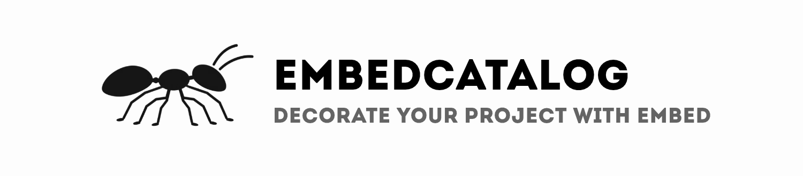
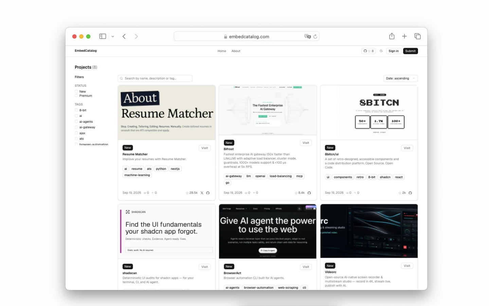

<div align="center">

  [](https://embedcatalog.com)

  <h1>EmbedCatalog</h1>

  <p>
    <a href="https://github.com/EmbedCatalog/embedcatalog/blob/main/LICENSE"></a>
    <a href="https://embedcatalog.com"></a>
    <a href="https://x.com/aanthonymax"></a>
  </p>
  <p>Project catalog where you can add yours and get interesting and practical embeds.</p>
</div>



## Table of contents

- [About](#about)
- [Features](#features)
  - [Catalog & discovery](#catalog--discovery)
  - [Embeds](#embeds)
  - [Custom embeds](#custom-embeds)
  - [Project pages](#project-pages)
  - [Upvotes & impressions](#upvotes--impressions)
  - [Moderation](#moderation)
- [How it works](#how-it-works)
- [What projects are suitable?](#what-projects-are-suitable)
- [Premium](#premium)
- [FAQ](#faq)
- [Tech stack](#tech-stack)
- [Project structure](#project-structure)
- [Running locally](#running-locally)
  - [Prerequisites](#prerequisites)
  - [Quick start](#quick-start)
  - [Environment variables](#environment-variables)
  - [Available scripts](#available-scripts)
- [Automation](#automation)
- [Contributing](#contributing)
- [License](#license)

## About

While developing open source projects, I kept wanting a way to highlight them without reaching for the same default badges everyone else uses. So I built a catalog where each project gets a relatively unique embed instead of a copy-paste one.

Submit your project, get listed, and drop a badge into your README or website. Everything else — the badge images, the project page, the stats — is handled by the platform.

## Features

### Catalog & discovery

The homepage lists every published project as a card with its cover image, description, and tags. Visitors can:

- Search by name, description, or tag
- Filter by status (`New`, added within the last 14 days) or `Premium`
- Filter by one or more tags
- Sort by newest/oldest, most upvoted, or most viewed

### Embeds

Each project gets ready-made embed badges, generated as static images and available in light and dark themes:

| Embed        | Light                                                                                                           | Dark                                                                                                                       | Plan    |
| ------------ | --------------------------------------------------------------------------------------------------------------- | -------------------------------------------------------------------------------------------------------------------------- | ------- |
| License      | [](https://embedcatalog.com/projects/hmpl)           | [](https://embedcatalog.com/projects/hmpl)           | Free    |
| Added to     | [](https://embedcatalog.com/projects/hmpl)               | [](https://embedcatalog.com/projects/hmpl)               | Free    |
| Organization | [](https://embedcatalog.com/projects/hmpl) | [](https://embedcatalog.com/projects/hmpl) | Premium |

### Custom embeds

Beyond the built-in badges, every project can design its own custom embed card (title, description, light/dark theme) straight from the account dashboard, and copy the ready HTML snippet for a README or website.

### Project pages

Every project gets its own page with:

- An image carousel for screenshots
- Live GitHub stats (stars, forks, contributors, license) refreshed automatically
- Tags and social links (X, YouTube, GitHub)
- A Markdown-powered "info" section — tables, task lists, code blocks with one-click copy, links, and images (including shields.io badges) all render through the same GitHub-flavored Markdown pipeline
- A generated Open Graph image for clean link previews when the project is shared

### Upvotes & impressions

Signed-in users can upvote a project once and remove their vote later — no downvotes, just a simple signal of interest. Page views are also tracked as impressions, batched client-side to keep the write volume low, and both numbers are shown on the project card and its page.

### Moderation

New submissions land in a moderation queue. Admins can approve, reject, mark a project as premium, or edit any listing before it goes live, so the catalog stays consistent and spam-free.

## How it works

1. Create an account and submit your project — title, tags, short description, and URL.
2. Optionally add screenshots, social links, and one or more embed variations.
3. Send it for review from your account, with an optional note for the moderators.
4. Once approved, your project is published, gets its own page, and its embeds become available to copy.
5. Keep an eye on impressions and upvotes as more people discover it.

## What projects are suitable?

- Open source
- Service
- Web app
- Developer tool
- Package
- Other technical projects

Commercial projects are also taken into work.

## Premium

The platform isn't focused on building an audience for its own sake — it's about steadily growing a project's visibility over time. Each month, a limited number of premium projects are accepted, and the team features them in relevant articles and content on other platforms (X posts, etc).

This keeps the workflow sustainable: as new months come in, there's still room to keep working on projects from previous months.

## FAQ

**Is listing a project free?**
Yes. Free listings get a project page, the base embed badges, and a custom embed you design yourself. Premium is optional and adds promotion and extra embeds.

**What happens after I submit a project?**
It goes into a moderation queue as a draft. An admin reviews it and either publishes, rejects, or asks for changes before it's shown in the catalog.

**Can I edit a project after it's published?**
Yes, from your account you can update details, images, embeds, and the Markdown info section at any time.

## Tech stack

| Layer     | Stack                                       |
| --------- | ------------------------------------------- |
| Framework | Next.js 16 (App Router, static export)      |
| Language  | TypeScript                                  |
| Styling   | Tailwind CSS v4, ShadCN-based UI components |
| Markdown  | react-markdown + remark-gfm                 |
| Backend   | Supabase (Postgres, Auth, Storage)          |
| Icons     | Lucide                                      |

## Project structure

```
app/            Routes (App Router): catalog, project pages, account, submit, embeds
components/     Shared UI and feature components (cards, forms, embeds, markdown, etc.)
lib/            Supabase clients, data mappers, and small utilities
scripts/        Build-time embed image generation and the GitHub stats sync job
public/         Static assets, including the site logo and preview image
```

## Running locally

### Prerequisites

| Requirement      | Version                                                                    |
| ---------------- | -------------------------------------------------------------------------- |
| Node.js          | 20+                                                                        |
| npm              | 10+                                                                        |
| Supabase project | with the `projects`, `project_embeds`, and `project_upvotes` tables set up |

### Quick start

```bash
# Clone the repository
git clone https://github.com/EmbedCatalog/embedcatalog.git
cd embedcatalog

# Install dependencies
npm install

# Configure environment variables
cp .env.example .env.local # create it if it doesn't exist yet, see below

# Start the dev server
npm run start
```

Open [http://localhost:3000](http://localhost:3000) to view the app.

### Environment variables

| Variable                        | Used by             | Purpose                                        |
| ------------------------------- | ------------------- | ---------------------------------------------- |
| `NEXT_PUBLIC_SUPABASE_URL`      | App, scripts        | Supabase project URL                           |
| `NEXT_PUBLIC_SUPABASE_ANON_KEY` | App                 | Public client for auth and data access         |
| `SUPABASE_SERVICE_ROLE_KEY`     | `sync-github-stats` | Server-side updates to GitHub stats            |
| `GITHUB_TOKEN`                  | `sync-github-stats` | Reads stars/forks/contributors from GitHub API |

### Available scripts

| Script              | What it does                                        |
| ------------------- | --------------------------------------------------- |
| `npm run start`     | Runs the app in development mode                    |
| `npm run build`     | Builds the static export and pre-renders embed PNGs |
| `npm run prod`      | Alias for `build`, used in production deploys       |
| `npm run lint`      | Runs ESLint                                         |
| `npm run format`    | Formats the codebase with Prettier                  |
| `npm run typecheck` | Runs the TypeScript compiler in `--noEmit` mode     |

## Automation

A scheduled GitHub Action runs `scripts/sync-github-stats.ts` daily to refresh each project's stars, forks, contributors, and license straight from the GitHub API, so project pages stay up to date without manual work.

## Contributing

The platform is open to your ideas and code! Thanks to everyone who helps make it better.

## License

Source code released under the AGPL-3.0 license. The application code is completely open source.

---

<div align="center">Made with 🌱 by <a href="https://x.com/aanthonymax">Anthony Max</a></div>
