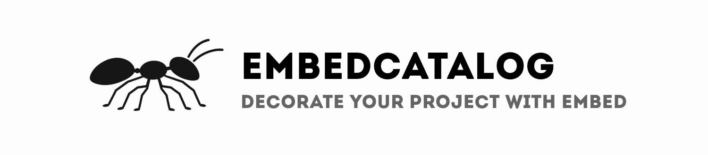
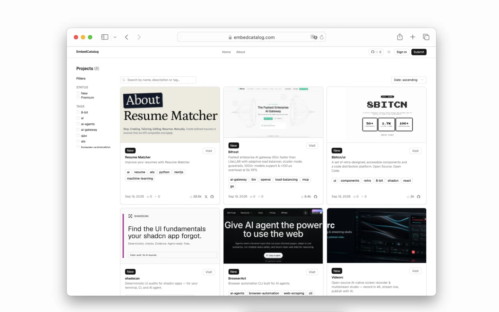

<div align="center">

[](https://embedcatalog.com/hacktoberfest-2026)

[](https://embedcatalog.com)

  <h1>EmbedCatalog</h1>
  <div align="center">
  <a href="https://embedcatalog.com">🌐 Website</a> • <a href="https://embedcatalog.com/account/create-project">💎 Create project</a> • <a href="https://embedcatalog.com/about">📄 About</a> • <a href="https://embedcatalog.com/submit">⚙️ Submit project</a>
  </div>
  <br/>
  <p>
    <a href="https://github.com/EmbedCatalog/embedcatalog/blob/main/LICENSE"></a>
    <a href="https://embedcatalog.com"></a>
    <a href="https://x.com/aanthonymax"></a>
  </p>
  <p>Project catalog where you can add yours and get interesting and practical embeds.</p>
</div>



## Table of contents

- [Idea](#idea)
- [Features](#features)
  - [Catalog & discovery](#catalog--discovery)
  - [Embeds](#embeds)
  - [Custom embeds](#custom-embeds)
  - [Project pages](#project-pages)
  - [Upvotes & impressions](#upvotes--impressions)
  - [Moderation](#moderation)
- [How it works](#how-it-works)
- [What projects are suitable?](#what-projects-are-suitable)
- [Premium](#premium)
- [FAQ](#faq)
- [Tech stack](#tech-stack)
- [Project structure](#project-structure)
- [Running locally](#running-locally)
  - [Prerequisites](#prerequisites)
  - [Quick start](#quick-start)
  - [Environment variables](#environment-variables)
  - [Available scripts](#available-scripts)
- [Data Synchronization](#data-synchronization)
- [Contributing](#contributing)
- [Star History](#star-history)
- [License](#license)

## Idea

While developing open source projects, one day I came up with the idea of ​​making a website for practical pictures for projects, since I wanted to somehow highlight my project rather than adding default ones. I don't want to copy others, so I made a catalog where each project will have a relatively unique embed.

## Features

### Catalog & discovery

On the main page, each published project is presented as a card featuring relevant images and project information. The platform also tracks views and upvotes, which are displayed on the card as well. Visitors can:

- Search by name, description, or tag
- Filter by status (`New`, added within the last 14 days) or `Premium`
- Filter by one or more tags
- Sort by newest/oldest, most upvoted, or most viewed

### Embeds

Each project gets ready-made embed badges, generated as static images and available in light and dark themes:

| Embed        | Light                                                                                                           | Dark                                                                                                                       | Plan    |
| ------------ | --------------------------------------------------------------------------------------------------------------- | -------------------------------------------------------------------------------------------------------------------------- | ------- |
| License      | [](https://embedcatalog.com/projects/hmpl)           | [](https://embedcatalog.com/projects/hmpl)           | Free    |
| Added to     | [](https://embedcatalog.com/projects/hmpl)               | [](https://embedcatalog.com/projects/hmpl)               | Free    |
| Organization | [](https://embedcatalog.com/projects/hmpl) | [](https://embedcatalog.com/projects/hmpl) | Premium |

### Custom embeds

Beyond the built-in badges, every project can design its own custom embed (title, description, light/dark theme) straight from the account dashboard, and copy the ready HTML snippet for a README or website.

Example:

[](https://embedcatalog.com/projects/is-kit)

### Project pages

Every project gets its own page with:

- An image carousel for screenshots
- Live GitHub stats (stars, forks, contributors, license) refreshed automatically
- Tags and social links (𝕏 (Twitter), YouTube, GitHub)
- A Markdown-powered "info" section — tables, task lists, etc. All render through the same GitHub-flavored Markdown pipeline
- A generated Open Graph image for clean link previews when the project is shared

### Upvotes & impressions

Signed-in users can upvote a project once. Page views are also tracked as impressions, batched client-side to keep the write volume low, and both numbers are shown on the project card and its page.

### Moderation

New submissions land in a moderation queue. Admins can approve, reject, mark a project as premium, or edit any listing before it goes live, so the catalog stays consistent and spam-free.

## How it works


1. Create an account and fill info about your project.
2. Optionally add social links, and one or more embed variations.
3. Send it for review from your account, with an optional note for the moderators.
4. Once approved, your project is published, gets its own page, and its embeds become available to copy.
5. Keep an eye on impressions and upvotes as more people discover it.

## What projects are suitable?

- Open source
- Service
- Web app
- Developer tool
- Package
- Other technical projects

Commercial projects are also taken into work.

## Premium

Essentially, we are not focused on creating an audience on the platform, although this is also important. The idea is to work on a project periodically, like an ant working on its visibility. The platform accepts a certain number of premium projects per month, and the project team will simply add them to relevant articles and create content about them on other platforms. For example, tweets, etc.

This flow allows us to work on projects as efficiently as possible. Also, if we move on to the next month, the number of projects will allow us to work on previous months' projects.

## FAQ

<details>
<summary><b>Is listing a project free?</b></summary>
  Yes. Free listings get a project page, the base embed badges, and a custom embed you design yourself. Premium is optional and adds promotion and extra embeds.
</details>

<details>
<summary><b>What happens after I submit a project?</b></summary>
  It goes into a moderation queue as a draft. An admin reviews it and either publishes, rejects, or asks for changes before it's shown in the catalog.
</details>

<details>
<summary><b>Can I edit a project after it's published?</b></summary>
  Yes, from your account you can update details, images, embeds, and the Markdown info section at any time (in development).
</details>

## Tech stack

| Layer     | Stack                                       |
| --------- | ------------------------------------------- |
| Framework | Next.js 16 (App Router, server runtime)     |
| Language  | TypeScript                                  |
| Styling   | Tailwind CSS v4, ShadCN-based UI components |
| Markdown  | react-markdown + remark-gfm                 |
| Backend   | Supabase (Postgres, Auth, Storage)          |
| Icons     | Lucide                                      |

## Project structure

```
app            Routes (App Router): catalog, project pages, account, submit, embeds
components     Shared UI and feature components (cards, forms, embeds, markdown, etc.)
lib            Supabase clients, data mappers, and utilities
scripts        Build-time embed image generation and the GitHub stats sync job
public         Static assets, including the site logo and preview image
```

## Running locally

### Prerequisites

| Requirement      | Version                                                                                         |
| ---------------- | ----------------------------------------------------------------------------------------------- |
| Node.js          | 20+                                                                                             |
| npm              | 10+                                                                                             |
| Supabase project | with the `projects`, `project_embeds`, `project_upvotes`, and `project_bookmarks` tables set up |

### Quick start

```bash
# Clone the repository
git clone https://github.com/EmbedCatalog/embedcatalog.git
cd embedcatalog

# Install dependencies
npm install

# Configure environment variables
cp .env.example .env.local # create it if it doesn't exist yet, see below

# Start the dev server
npm run start
```

Open [http://localhost:3000](http://localhost:3000) to view the app.

### Environment variables

| Variable                        | Used by             | Purpose                                                     |
| ------------------------------- | ------------------- | ----------------------------------------------------------- |
| `NEXT_PUBLIC_SITE_URL`          | App                 | Canonical site URL (defaults to `https://embedcatalog.com`) |
| `NEXT_PUBLIC_SUPABASE_URL`      | App, image routes   | Supabase project URL                                        |
| `NEXT_PUBLIC_SUPABASE_ANON_KEY` | App, image routes   | Public client for auth and data access                      |
| `SUPABASE_SERVICE_ROLE_KEY`     | `sync-github-stats` | Server-side updates to GitHub stats                         |
| `GITHUB_TOKEN`                  | `sync-github-stats` | Reads stars/forks/contributors from GitHub API              |

### Available scripts

| Script              | What it does                                       |
| ------------------- | -------------------------------------------------- |
| `npm run start`     | Runs the app in development mode                   |
| `npm run build`     | Builds Next.js; embed PNGs are rendered on request |
| `npm run serve`     | Runs the production Next.js server                 |
| `npm run prod`      | Alias for `build`, used by Vercel                  |
| `npm run lint`      | Runs ESLint                                        |
| `npm run format`    | Formats the codebase with Prettier                 |
| `npm run typecheck` | Runs the TypeScript compiler in `--noEmit` mode    |

### Deployment

The app requires a Node.js-capable Next.js host. To deploy with Vercel, import
the GitHub repository as a Next.js project, keep the root directory and output
directory at their defaults, and add `NEXT_PUBLIC_SUPABASE_URL` and
`NEXT_PUBLIC_SUPABASE_ANON_KEY` to the Production and Preview environments.
Dynamic embed images query approved/published records from Supabase at request
time. Set both Supabase variables for Production and Preview deployments; they
are also needed during build because `NEXT_PUBLIC_*` values are bundled into
the client. Set `NEXT_PUBLIC_SITE_URL` to the canonical production URL in the
Production environment if it differs from the default.
Vercel deploys pushes to the connected branches automatically. GitHub Pages
static hosting is not supported because user profile routes are resolved at
runtime.

## Data Synchronization

A scheduled GitHub Action runs `scripts/sync-github-stats.ts` daily to refresh each project's stars, forks, contributors, and license straight from the GitHub API, so project pages stay up to date without manual work.

## Contributing

We have a [Contributing Guide](https://github.com/embedcatalog/embedcatalog/blob/main/CONTRIBUTING.md) that describes the main steps for contributing to the project.

The platform is open to your ideas and code! Thanks to everyone who helps make it better.

## Star History

<a href="https://www.star-history.com/?repos=embedcatalog%2Fembedcatalog&type=date&legend=top-left">
 <picture>
   <source media="(prefers-color-scheme: dark)" srcset="https://api.star-history.com/chart?repos=embedcatalog/embedcatalog&type=date&theme=dark&legend=top-left" />
   <source media="(prefers-color-scheme: light)" srcset="https://api.star-history.com/chart?repos=embedcatalog/embedcatalog&type=date&legend=top-left" />
   
 </picture>
</a>

## License

Source code released under the [AGPL-3.0 license](https://github.com/embedcatalog/embedcatalog/blob/main/LICENSE).

---

<div align="center">
  <i>The application code is completely open source 🌱!</i>

<b>☆ <a href="https://github.com/embedcatalog/embedcatalog">Star this repo</b>
</div>
